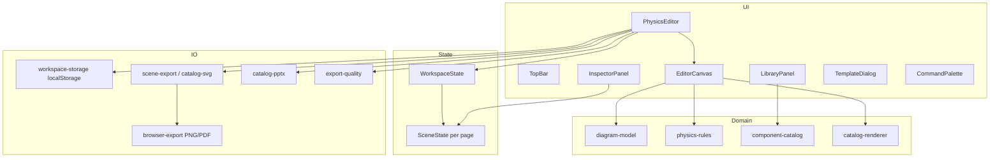

# プロジェクト概要 (Physics Diagram Editor)

力学図・自由体図・構造力学図を、PowerPoint に頼らず**教科書品質**で素早く作るための Web エディタです。変量（質量・角度・張力など）と幾何拘束をデータとして持ち、キャンバス編集・テンプレート・多形式エクスポートまでを一つのアプリで行います。

---

## 1. 目的と位置づけ

| 観点 | 内容 |
|------|------|
| **ユーザー** | 物理教員、研究者、学生、問題作成者 |
| **解く課題** | 汎用 PPT/CAD では物理記号・接触・力の関係を毎回手作業で整えるコストが高い |
| **差別化** | 部品カタログ、参照付きベクトル、接触面セマンティクス、テンプレート、品質ゲート付き出力 |
| **ホスティング** | [vinext](https://github.com/cloudflare/vinext) 上の Next.js 16 アプリ（Cloudflare Workers / 任意 D1・R2） |

詳細な機能ロードマップは [ISSUE-009](./issues/ISSUE-009-roadmap-to-world-class-physics-editor.md)、実装設計の厳密仕様は [DESIGN-SPECIFICATION.md](./DESIGN-SPECIFICATION.md) を参照。

---

## 2. 技術スタック

| レイヤ | 技術 |
|--------|------|
| フレームワーク | Next.js 16、React 19 |
| ビルド / 開発 | vinext、Vite 8、Wrangler |
| スタイル | Tailwind CSS 4 |
| アイコン | lucide-react |
| ORM（任意） | Drizzle ORM + D1（スキーマは現状ほぼ空、`examples/d1/` にサンプル） |
| エクスポート | 自前 SVG/Canvas、`jspdf` + `svg2pdf.js`、`pptxgenjs` |
| 単体テスト | Vitest + jsdom |
| E2E | Playwright（`e2e/p0-editor.spec.ts` が P0 要件の主戦場） |
| Node | `>= 22.13.0` |
| パッケージマネージャ | pnpm（`package-lock.json` も存在） |

### 主要 npm スクリプト

```bash
pnpm run dev          # ローカル開発（vinext dev）
pnpm run build        # 本番ビルド
pnpm run typecheck    # tsc --noEmit
pnpm run test:unit    # Vitest
pnpm run test:e2e     # Playwright
pnpm test             # unit + build + rendered-html スモーク
```

---

## 3. リポジトリ構成

```
physics-diagram-editor/
├── app/                    # Next.js アプリ（サイト本体）
│   ├── page.tsx            # トップ: PhysicsEditor のみ
│   ├── layout.tsx, globals.css
│   ├── chatgpt-auth.ts     # OpenAI Sites 向け SIWC ヘルパ（任意）
│   ├── components/         # UI（後述）
│   └── lib/                # ドメインロジック（後述）
├── build/sites-vite-plugin.ts
├── db/                     # Drizzle スキーマ（拡張用）
├── docs/                   # 設計・品質・チケット
├── e2e/                    # Playwright
├── examples/d1/            # D1 API サンプル
├── public/
├── tests/                  # Vitest 単体
├── worker/index.ts         # Cloudflare Worker エントリ
├── vite.config.ts
└── .openai/hosting.json    # D1/R2 バインディング宣言
```

**編集の中心**は `app/` 配下。README の「vinext スタータ」説明はインフラ向けで、**プロダクトの本体は力学図エディタ**です。

---

## 4. アーキテクチャ（データフロー）



- **WorkspaceState**: 複数ページ（シート）、パネル幅、ズーム、UI 密度などアプリ全体の状態。
- **SceneState**: 1 ページ分の図。レガシー斜面ウィザード用フィールド（`angle`, `blockPosition`, `showGravity` 等）と、汎用 **`elements` / `variables` / `constraints`** が共存。
- **EditorCanvas**: HTML Canvas に `drawScene` で描画。ヒットテスト・ドラッグ・スナップ・範囲選択などインタラクションの大部分を担当（大規模ファイル）。
- **PhysicsEditor**: undo/redo、localStorage 永続化、エクスポート、キーボードショートカット、ツール状態のオーケストレーション。

---

## 5. データモデル（要約）

定義の正本: `app/lib/editor-types.ts`

### 5.1 DiagramElement

キャンバス上の 1 部品。`kind` は 60 種以上（物体・接触面・支持・接続・滑車・ベクトル・注釈など）。

重要フィールド:

- 幾何: `x`, `y`, `width`, `height`, `rotation`
- 接続: `startTargetId` / `endTargetId`、比率 `startTargetRatio` / `endTargetRatio`、面 `startFaceName` / `endFaceName`
- 参照: `referenceTargetId`（重力・法線・張力などが物体に追従）
- 表示: `label`, `labelOffsetX/Y`, `shapeStyle`（斜面 wedge/line）, `locked`, `visible`

### 5.2 Variable / Constraint

- **Variable**: 記号・型（scalar/vector/angle/mass…）・単位・値。`referenceIds` で図形と紐付け。
- **Constraint**: `contact`, `connection`, `parallel`, `axis-follow` など。`targetIds` と `strength`（required/preferred）。

### 5.3 ページとワークスペース

- **DiagramPage**: `id`, `title`, `kind`（`incline` | `freebody` | `blank`）, `scene`
- **WorkspaceState**: `schemaVersion: 2`, `pages[]`, `activePageId`, パネル・ズーム設定

初期状態は斜面シート + 自由体図シートの 2 ページ（`INITIAL_WORKSPACE`）。

---

## 6. ドメインモジュール (`app/lib/`)

| モジュール | 責務 |
|------------|------|
| `editor-types.ts` | 型、初期状態、SelectionId / ToolId / TemplateId |
| `component-catalog.ts` | `PHYSICS_COMPONENT_CATALOG`、部品生成 `createDiagramElement`、検索 |
| `diagram-model.ts` | 接続解決 `resolveDiagramElement`、面中点、ベクトル成分分解、依存削除、参照整合性 |
| `physics-rules.ts` | 接触面ツールとシーンの角度・摩擦・配置パッチ |
| `catalog-renderer.ts` | Canvas 描画 `drawDiagramElement`、当たり判定 |
| `catalog-svg.ts` | 部品 → SVG 断片 |
| `scene-export.ts` | シーン全体 SVG（レガシー斜面レイヤ + カタログ要素） |
| `catalog-pptx.ts` | PPTX スライドへ編集可能図形として出力 |
| `browser-export.ts` | SVG → PNG blob、複数 SVG → PDF |
| `export-quality.ts` | エクスポート前の自動品質チェック（欠落・重なり等） |
| `export-types.ts` | 背景・余白・範囲などエクスポート設定 |
| `template-builder.ts` | `TemplateId` から初期 `SceneState` を構築（斜面、Atwood、梁など） |
| `workspace-storage.ts` | localStorage 復元 `restoreWorkspace` / 正規化 `normalizeScene` |
| `clipboard.ts` | クリップボード書き込み |

幾何・物理の「意味」は **diagram-model + physics-rules + catalog** の三層に分かれています。描画は **catalog-renderer**（Canvas）と **catalog-svg**（ベクター出力）で共有概念を別実装しています。

---

## 7. UI コンポーネント (`app/components/`)

| コンポーネント | 役割 |
|----------------|------|
| `PhysicsEditor.tsx` | ルート。状態管理、永続化、undo/redo、エクスポート UI |
| `EditorCanvas.tsx` | メインキャンバス（描画・操作・スナップ・マーキー等） |
| `LibraryPanel.tsx` | 部品ライブラリ（追加 / 構造タブ、検索） |
| `InspectorPanel.tsx` | 選択対象の数値・ラベル・ページ種別に応じたインスペクタ |
| `TopBar.tsx` | ページ切替、ズーム、グリッド、エクスポート入口 |
| `TemplateDialog.tsx` | テンプレート一覧と適用 |
| `CommandPalette.tsx` | コマンドパレット |
| `SceneInputs.tsx` / `VariableInput.tsx` / `NumericInput.tsx` | フォーム部品 |

ルート要素は `.physics-editor` で、E2E は `data-hydrated="true"` を hydration 完了の目印に使用。

---

## 8. テンプレート

`TemplateId` 例: `horizontal`, `incline`, `pulley`, `freebody`, `atwood`, `pendulum`, `simply-supported-beam`, `cantilever-beam`, `portal-frame` など。

`buildTemplateScene()` がカタログ部品と `createReferencedElement` / `createConnection` で配置済みシーンを生成。テンプレ適用時は**新規ページ追加**が設計上の期待動作（[DESIGN-SPECIFICATION §3.2](./DESIGN-SPECIFICATION.md)、ISSUE-002）。

---

## 9. 永続化

- **キー**: `physics-editor-workspace-v1`（`WORKSPACE_STORAGE_KEY`）
- **場所**: ブラウザ `localStorage`
- **復元**: 未知フィールドのマージ、数値クランプ、不正 `kind` の除去、ID 重複解消（`normalizeScene` / `restoreWorkspace`）
- サーバー DB は現状必須ではない（D1 は将来のユーザー別保存用の足場）

---

## 10. エクスポート

| 形式 | 経路 |
|------|------|
| SVG | `sceneToSvg` / 部品 SVG |
| PNG | ブラウザで SVG ラスタ化 |
| PDF | 複数ページ SVG を `svg2pdf` |
| PPTX | `pptxgenjs` + `addCatalogElementsToPptx` |

エクスポート前に `inspectExportQuality` でページ単位の問題を列挙可能。品質要件は [QUALITY-TEST-MATRIX.md](./QUALITY-TEST-MATRIX.md) の OUT-* / VIS-* 等と対応。

---

## 11. 認証（任意）

OpenAI Workspace Sites 向け:

- リクエストヘッダ `oai-authenticated-user-email` 等
- `app/chatgpt-auth.ts` で SIWC の optional/required ヘルパ

力学図エディタのコア機能は**匿名利用可能**（ヘルパ未使用ルート）。メンバーシップは Sites のアクセスポリシー側。

---

## 12. テストと品質

| 種別 | 場所 | 内容例 |
|------|------|--------|
| 単体 | `tests/*.test.ts` | カタログ、diagram-model、physics-rules、workspace 復元、PPTX、描画レイヤ VIS-001 |
| E2E | `e2e/p0-editor.spec.ts` | P0 作図・保存・エクスポート・コンソールエラー監視 |
| 品質基準 | `docs/QUALITY-TEST-MATRIX.md` | P0/P1/P2、リリースゲート、レイヤー順序 |
| 実施記録 | `docs/TEST-RESULTS.md` | 手動・自動の結果ログ |

開発フロー（`.agents/AGENTS.md`）: **チケット 1 件ごと**に実装 → `npm run typecheck` & `npm run test:unit` → commit → push。

---

## 13. チケット / イシュー索引

`docs/issues/` に機能・バグの設計メモ（ISSUE-001〜011）:

| ID | テーマ（短縮） |
|----|----------------|
| 001 | 線の接続点（エッジ比率） |
| 002 | テンプレ配置・シート切替 |
| 003 | 回転角度スナップ |
| 004 | 推論スナップ / スマートガイド |
| 005 | CAD 風マーキー選択 |
| 006 | 8 点スケール |
| 007 | 変数ラベルのドラッグ |
| 008 | 斜面 wedge 形状 |
| 009 | 世界一エディタロードマップ |
| 010 | 総合監査 |
| 011 | 最小クリックワークフロー |

実装状況はコードとテストを正とし、上記 MD は要求・設計のトレーサビリティ用。

---

## 14. 新規参加者向けクイックパス

1. `pnpm install` → `pnpm run dev` でエディタを開く。
2. `app/page.tsx` → `PhysicsEditor` → `EditorCanvas` の順に UI を追う。
3. 部品追加の流れ: `LibraryPanel` → `createDiagramElement` → `scene.elements` → `drawDiagramElement`。
4. 力の追従: `referenceTargetId` と `getElementActionPoint` / `resolveDiagramElement`（`diagram-model.ts`）。
5. 変更後は必ず `pnpm run typecheck` と `pnpm run test:unit`。

---

## 15. 関連ドキュメント

| ドキュメント | 用途 |
|--------------|------|
| [README.md](../README.md) | クイックスタート、vinext、SIWC |
| [DESIGN-SPECIFICATION.md](./DESIGN-SPECIFICATION.md) | データモデル拡張・アルゴリズム詳細 |
| [QUALITY-TEST-MATRIX.md](./QUALITY-TEST-MATRIX.md) | 要件 ID と合格条件 |
| [TEST-RESULTS.md](./TEST-RESULTS.md) | テスト実行記録 |
| [issues/ISSUE-009-*](./issues/ISSUE-009-roadmap-to-world-class-physics-editor.md) | 中長期ロードマップ |

---

*最終更新: プロジェクト構造調査に基づく概要（コードベース v0.1.0 時点）。*
